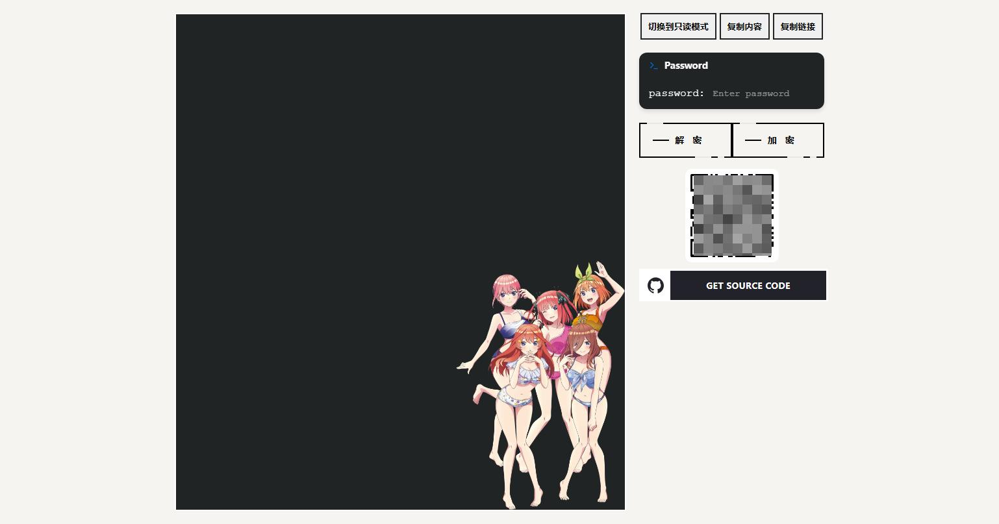
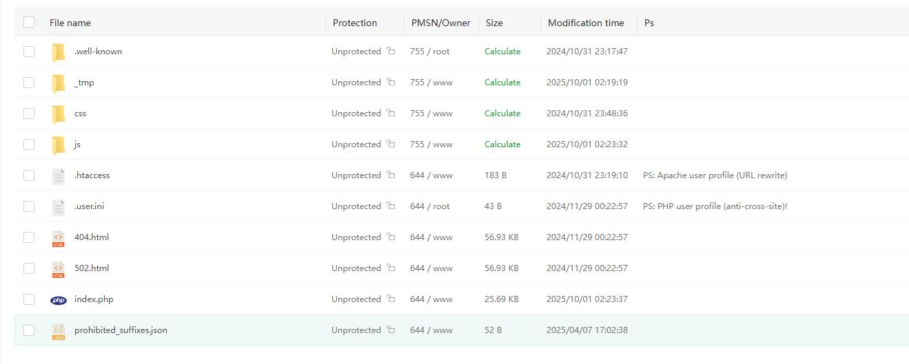
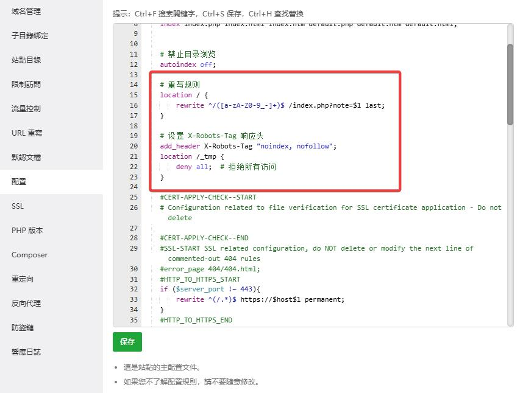

# Web Notepad

一个极简的网页便签/文本分享工具。支持编辑/只读切换、自动保存、复制内容/链接、二维码分享、客户端 AES 加解密、原始文本输出（便于命令行获取）。

注意：本项目为单文件 index.php（纯 PHP，无框架）。需要准备保存目录与后缀黑名单文件后即可运行。

## 图片





## 功能特性

- 便签按名称保存（仅限字母/数字/下划线/中划线，长度 ≤ 64）
- 新建随机便签并返回链接（API）
- 自动保存（防抖 1s，POST 提交）
- 编辑模式 / 只读模式一键切换
- 一键复制内容 / 复制链接 / 显示二维码
- 客户端 AES 加密/解密（CryptoJS），服务端仅存储结果
- 原始文本输出模式（?raw 或 curl/Wget UA）
- 安全防护：
  - 名称校验与 basename 处理，防目录遍历
  - 可配置的“禁止后缀”黑名单
  - 100KB 内容大小限制
  - 文件锁防并发写入
  - 输出内容进行 HTML 转义防 XSS

## 目录结构与依赖

- WebNotepad/
  - index.php（主程序）
  - README.md（说明）
  - _tmp/（笔记存储目录，需手动创建，可放在更安全的位置）
  - prohibited_suffixes.json（禁止后缀清单，需手动创建）
  - img/（可选，界面使用的图片资源）

外部前端依赖（通过 CDN 引入，无需本地安装）：
- CryptoJS (AES)：https://cdnjs.cloudflare.com/ajax/libs/crypto-js/4.1.1/crypto-js.min.js
- qrcodejs：https://cdnjs.cloudflare.com/ajax/libs/qrcodejs/1.0.0/qrcode.min.js

## 快速开始

1) 创建存储目录（建议放在根目录，下载之后上传到服务器）
- 文件存储在 .'/_tmp'

2) 创建禁止后缀清单文件
在 prohibited_suffixes.json 写入如下内容（可按需调整）：
{
    "prohibited_suffixes": ["text", "tg", "py"]
}

- 如果你禁止某个文件修改可以添加在prohibited_suffixes.json。

3) 启动

访问：
- 查询参数模式（推荐，无需重写）：http://127.0.0.1:8000/index.php?note=demo
- 友好 URL（需要重写/伪静态）：http://127.0.0.1:8000/demo
  - 或者自己访问：http://127.0.0.1:8000/ 会随机生成字符串
  - 注意：index.php 会在未提供或非法 note 名时重定向到 ./随机名
  - 若无 URL 重写，重定向后的 ./随机名 将 404，请使用查询参数模式

Nginx/Apache 等生产环境请配置重写规则，将 /{name} 转发为 /index.php?note={name}

**添加网站conf配置**
```
    # 重写规则
    location / {
        rewrite ^/([a-zA-Z0-9_-]+)$ /index.php?note=$1 last;
    }
    
    # 设置 X-Robots-Tag 响应头
    add_header X-Robots-Tag "noindex, nofollow";
    location /_tmp {
        deny all;  # 拒绝所有访问
    }

```

## 使用说明

- 首次访问一个不存在的便签名时会进入“编辑模式”，自动显示文本框，可直接输入；已有便签默认“只读模式”
- 右侧按钮：
  - 切换编辑/只读
  - 复制内容
  - 复制链接（当前 URL）
  - AES 加密/解密（输入密码后点击加密/解密）
  - 二维码（分享当前链接）
- 自动保存：编辑内容停止输入约 1 秒即触发一次自动保存（POST 提交）
- 打印：打印样式仅输出正文

提示：
- AES 加解密为“客户端侧”行为，服务端不会校验密钥正确与否；加密后的密文将被原样保存
- 遗忘密码将无法恢复明文

## 接口文档

基地址：/index.php（示例以此为前缀；若做了重写，可直接用 /{name} 形式）

1) 新建随机地址文本（GET）
- 路径：/?new&text=...（当 index.php 在站点根目录时更易用；否则请改用查询参数模式访问）
- 参数：
  - text：要保存的内容（最大 100KB）
- 响应：JSON，形如 {"url":"https://host/<random>"}
- 备注：该 URL 生成逻辑使用 $_SERVER['REQUEST_SCHEME'] 与 $_SERVER['HTTP_HOST'] 且假设根路径，若你的部署在子目录，建议自行拼接正确前缀或使用查询参数模式

2) 新建/修改指定名称（GET）
- 路径：?note={name}&text=...
- 参数：
  - note：便签名（字母/数字/下划线/中划线，长度 ≤ 64，且不得命中禁止后缀）
  - text：要保存的内容（最大 100KB）
- 响应：JSON：{status: "success"|"error", message: "..."} 

3) 获取便签原文（GET）
- 路径：?note={name}&raw
- 响应：
  - 200 text/plain：便签原文
  - 404：不存在
- 特性：若 User-Agent 以 "curl" 或 "Wget" 开头，也会返回原文 text/plain

4) 保存/更新便签（POST）
- 路径：当前页面（location.pathname）
- Content-Type：application/x-www-form-urlencoded
- Body：text=...（最大 100KB）
- 响应：无正文（保存失败时会直接报错并中止）

## 配置与安全

- 保存目录：index.php 中 $notes_directory = __DIR__ . '/_tmp'
  - 强烈建议使用绝对路径，并放置在 Web 根目录之外
  - 确保该目录可写（PHP 进程权限）
- 禁止后缀：来自 WebNotepad/prohibited_suffixes.json
  - 文件必须存在且可读
  - 命中后缀即拒绝（如 name.php）
- 名称规则：^[a-zA-Z0-9_-]+$ 且长度 ≤ 64；内部使用 basename 防路径注入
- 大小限制：100KB（超过直接拒绝）
- 并发写入：采取文件锁（flock）
- XSS 防护：渲染时对内容进行 htmlspecialchars 转义
- 缓存控制：Cache-Control: no-store

## 常见问题（FAQ）

1) 没有重写规则时如何访问？
- 使用查询参数模式：http://host/path/index.php?note=demo
- 避免依赖 index.php 发起的 ./随机名 重定向（该重定向在无重写时可能导致 404）

2) “随机新建并返回 URL”接口返回的 URL 不正确？
- 该接口假设站点部署在根路径（/）。若你部署在子目录，返回的 URL 可能缺少子路径。可自行在前端拼接，或使用查询参数模式直接访问。

3) prohibited_suffixes.json 必须存在吗？
- 是。程序启动即会读取该文件，不存在会导致错误或不可用。按“快速开始”中的示例创建即可。

4) 加密是否安全？
- 加解密在浏览器侧完成，服务端不知密钥。请使用强口令并妥善保存；密钥丢失无法恢复明文。该功能旨在“轻量分享”，不替代专业安全产品。

## 致谢

本项目基于 [minimalist-web-notepad](https://github.com/pereorga/minimalist-web-notepad) 改进，感谢原作者的开源贡献。